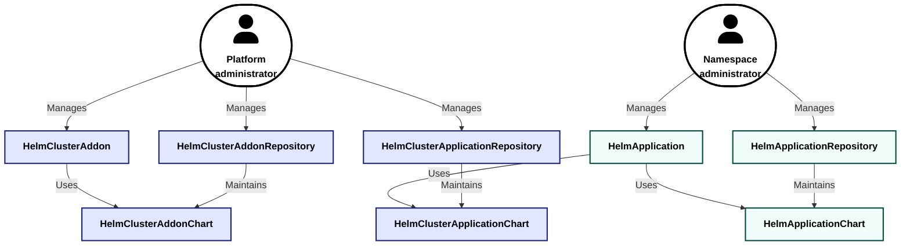

The `operator-helm` module deploys Helm charts declaratively and targets two audiences: platform administrators and namespace administrators. It divides charts into addons and applications according to the objects they create.

**Addons** ([`HelmClusterAddon`](/modules/operator-helm/cr.html#helmclusteraddon)) may contain CRDs and other cluster-scoped objects, so a platform administrator deploys them. Such a Helm chart can affect the state of the cluster, so managing it stays at the cluster level.

**Applications** ([`HelmApplication`](/modules/operator-helm/cr.html#helmapplication)) consist solely of objects that belong to a single namespace. A namespace administrator deploys them.

## Key features

The module provides the following capabilities:

- declarative management of Helm chart deployment;
- installing charts from HTTP(S) and OCI repositories through the same API;
- automatic repository synchronization for browsing and searching the available Helm charts and their versions;
- chart installation by a namespace administrator without granting them cluster-wide rights;
- support for shared application repositories available in every namespace;
- automatic correction of configuration drift;
- maintenance mode that pauses reconciliation so that a release can be modified manually;
- support for private repositories that use a corporate PKI;
- management via `d8 k` or the Deckhouse Platform web interface.

## Custom resources

The module's resources fall into two groups by scope. Cluster-scoped resources are managed by a platform administrator, and the resources of a given namespace by a namespace administrator.

Blue fill marks cluster-scoped resources; turquoise marks the resources inside a namespace. The module maintains the chart catalogs itself; they are not edited by hand.

A platform administrator works with the cluster-scoped resources:

- [`HelmClusterAddonRepository`](/modules/operator-helm/cr.html#helmclusteraddonrepository) — a Helm or OCI repository with charts to be installed at the cluster level;
- [`HelmClusterAddon`](/modules/operator-helm/cr.html#helmclusteraddon) — a release description: the target chart version, the namespace to deploy into and, where required, extended installation parameters;
- [`HelmClusterApplicationRepository`](/modules/operator-helm/cr.html#helmclusterapplicationrepository) — a repository whose charts are available to [`HelmApplication`](/modules/operator-helm/cr.html#helmapplication) resources from any namespace.

A namespace administrator works with the resources of their own namespace:

- [`HelmApplicationRepository`](/modules/operator-helm/cr.html#helmapplicationrepository) — a repository whose charts are available to [`HelmApplication`](/modules/operator-helm/cr.html#helmapplication) resources of the same namespace;
- [`HelmApplication`](/modules/operator-helm/cr.html#helmapplication) — a release description in the administrator's own namespace: the target chart version, a reference to a [`HelmApplicationRepository`](/modules/operator-helm/cr.html#helmapplicationrepository) or a [`HelmClusterApplicationRepository`](/modules/operator-helm/cr.html#helmclusterapplicationrepository) and, where required, extended installation parameters.

Configuration examples for the resources described above are given in the [administrator guide](admin_guide.html) and the [user guide](user_guide.html).

## Limitations

- A [`HelmClusterAddon`](/modules/operator-helm/cr.html#helmclusteraddon) resource referring to a given [`HelmClusterAddonChart`](/modules/operator-helm/cr.html#helmclusteraddonchart) can only be created as a single instance. Helm charts used in an addon may contain custom resource definitions (CRDs), and installing them again at the cluster level can disrupt running services;
- Creating a [`HelmApplication`](/modules/operator-helm/cr.html#helmapplication) requires permissions no lower than `Admin`, because applications are deployed using a `ServiceAccount` that holds equivalent privileges.
