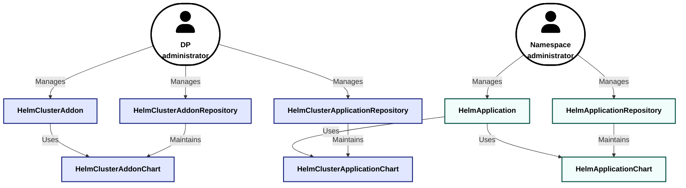

The `operator-helm` module lets you control declaratively the Helm chart deployment in the Deckhouse Platform (DP) cluster.

Depending on the scope of created resources, Helm charts are divided in addons and applications:

- **Addons** ([HelmClusterAddon](/modules/operator-helm/cr.html#helmclusteraddon)) may create custom and other cluster-wide resources. A DP administrator deploys and controls them.
- **Applications** ([HelmApplication](/modules/operator-helm/cr.html#helmapplication)) create only namespaced resources. A namespace administrator can deploy applications and control them within a designated namespace.

To enable the module, use one of the methods described on the ["Configuration"](configuration.html) page.

## Key features

The module provides the following capabilities:

- Declarative management of Helm chart deployment.
- Installing charts from HTTP(S) and OCI repositories through the same API.
- Automatic repository synchronization for browsing and searching the available Helm charts and their versions.
- Chart installation by a namespace administrator without granting them cluster-wide rights.
- Support for shared application repositories available in every namespace.
- Automatic correction of configuration drift.
- Maintenance mode that pauses reconciliation so that a release can be modified manually.
- Support for private repositories that use a corporate PKI.
- Management via the [`d8`](/products/kubernetes-platform/documentation/v1/cli/d8/) CLI tool or the DP web interface.

## Custom resources

The module's resources fall into two groups by scope: cluster-wide resources that are managed by a DP administrator, and the namespaced resources managed by a namespace administrator.

```mermaid
flowchart TB
  classDef actor fill:#ffffff,stroke:#000000,color:#000000,stroke-width:3px;
  classDef cluster fill:#e0e7ff,stroke:#1a237e,color:#000000,stroke-width:2px;
  classDef ns fill:#f0fdfa,stroke:#004d40,color:#000000,stroke-width:2px;

  ADM(["<font size=12px>fa:fa-user</font><br/><b>DP<br/>administrator</b>"]):::actor
  USR(["<font size=12px>fa:fa-user</font><br/><b>Namespace<br/>administrator</b>"]):::actor

  HCA["<b>HelmClusterAddon</b>"]:::cluster
  HCAR["<b>HelmClusterAddonRepository</b>"]:::cluster
  HCApR["<b>HelmClusterApplicationRepository</b>"]:::cluster

  HA["<b>HelmApplication</b>"]:::ns
  HAR["<b>HelmApplicationRepository</b>"]:::ns

  HCAC["<b>HelmClusterAddonChart</b>"]:::cluster
  HCApC["<b>HelmClusterApplicationChart</b>"]:::cluster
  HAC["<b>HelmApplicationChart</b>"]:::ns

  ADM -->|Manages| HCA
  ADM -->|Manages| HCAR
  ADM -->|Manages| HCApR
  HCA -->|Uses| HCAC
  HCAR -->|Maintains| HCAC

  USR -->|Manages| HA
  USR -->|Manages| HAR
  HA -->|Uses| HAC
  HA -->|Uses| HCApC
  HAR -->|Maintains| HAC

  HCApR -->|Maintains| HCApC
```

Blue fill marks cluster-wide resources; turquoise marks the namespaced resources. The module maintains the HelmClusterAddonChart, HelmClusterApplicationChart and HelmApplicationChart resources on its own. They should not be edited manually.

A DP administrator works with the following cluster-wide resources:

- [HelmClusterAddonRepository](/modules/operator-helm/cr.html#helmclusteraddonrepository): Defines a Helm or OCI repository with charts to be installed at the cluster level.
- [HelmClusterAddon](/modules/operator-helm/cr.html#helmclusteraddon): Defines a Helm release, including the target chart version, the namespace to deploy into and, where required, extended installation parameters.
- [HelmClusterApplicationRepository](/modules/operator-helm/cr.html#helmclusterapplicationrepository): Defines an application repository whose charts are available to [HelmApplication](/modules/operator-helm/cr.html#helmapplication) resources from any namespace.

A namespace administrator manages the following resources in the designated namespace:

- [HelmApplicationRepository](/modules/operator-helm/cr.html#helmapplicationrepository): Defines an application repository whose charts are available to [HelmApplication](/modules/operator-helm/cr.html#helmapplication) resources of the same namespace.
- [HelmApplication](/modules/operator-helm/cr.html#helmapplication): Defines a Helm release, including the target chart version, a repository and installation parameters. You can use a [HelmApplicationRepository](/modules/operator-helm/cr.html#helmapplicationrepository) or [HelmClusterApplicationRepository](/modules/operator-helm/cr.html#helmclusterapplicationrepository) as the chart source.

For configuration examples for the resources described above, refer to the ["Administrator guide"](admin_guide.html) and ["User guide"](user_guide.html) pages.

## Limitations

- For a single [HelmClusterAddonChart](/modules/operator-helm/cr.html#helmclusteraddonchart) resource, only one referring [HelmClusterAddon](/modules/operator-helm/cr.html#helmclusteraddon) resource can be created. Helm charts used in an addon may contain custom resource definitions (CRDs) and other cluster-wide resources, which, if installed repeatedly, may cause service failures.
- Creating a [HelmApplication](/modules/operator-helm/cr.html#helmapplication) requires permissions of no lower than the [`Admin`](/modules/user-authz/#current-role-based-model) role, because applications are deployed using a ServiceAccount that holds equivalent privileges.
