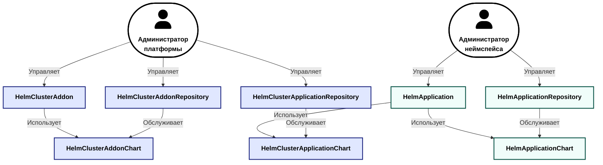

Модуль `operator-helm` декларативно разворачивает Helm-чарты и рассчитан на две аудитории: администраторов платформы и администраторов неймспейсов. Чарты он делит на аддоны и приложения — по тому, какие объекты они создают.

**Аддоны** ([`HelmClusterAddon`](/modules/operator-helm/cr.html#helmclusteraddon)) могут содержать CRD и другие кластерные объекты, поэтому их разворачивает администратор платформы. Такой Helm-чарт может влиять на состояние кластера, и управление им остаётся на уровне кластера.

**Приложения** ([`HelmApplication`](/modules/operator-helm/cr.html#helmapplication)) состоят только из объектов, относящихся к конкретному неймспейсу. Их разворачивает администратор неймспейса.

## Основные возможности

Модуль предоставляет следующие возможности:

- декларативное управление развёртыванием Helm-чартов;
- установка чартов из HTTP(S)- и OCI-репозиториев через один и тот же API;
- автоматическая синхронизация репозитория для просмотра и поиска доступных Helm-чартов и их версий;
- установка чартов администратором неймспейса без выдачи ему прав на кластер;
- поддержка общих репозиториев приложений, доступных во всех неймспейсах;
- автоматическое устранение дрейфа конфигурации;
- режим обслуживания, который приостанавливает реконсиляцию для ручного вмешательства в релиз;
- поддержка приватных репозиториев с использованием корпоративного PKI;
- управление через `d8 k` или веб-интерфейс Deckhouse Kubernetes Platform.

## Кастомные ресурсы

Ресурсы модуля делятся на две группы по области видимости. Кластерными ресурсами управляет администратор платформы, а ресурсами в заданном неймспейсе — администратор неймспейса.

Синей заливкой отмечены кластерные ресурсы, бирюзовой — ресурсы внутри неймспейса. Каталоги чартов модуль обслуживает сам, вручную они не редактируются.

Администратор платформы работает с кластерными ресурсами:

- [`HelmClusterAddonRepository`](/modules/operator-helm/cr.html#helmclusteraddonrepository) — репозиторий Helm или OCI с чартами для установки на уровне кластера;
- [`HelmClusterAddon`](/modules/operator-helm/cr.html#helmclusteraddon) — описание релиза: целевая версия чарта, неймспейс развёртывания и расширенные параметры установки (при необходимости);
- [`HelmClusterApplicationRepository`](/modules/operator-helm/cr.html#helmclusterapplicationrepository) — репозиторий, чарты которого доступны ресурсам [`HelmApplication`](/modules/operator-helm/cr.html#helmapplication) из любого неймспейса.

Администратор неймспейса работает с ресурсами своего неймспейса:

- [`HelmApplicationRepository`](/modules/operator-helm/cr.html#helmapplicationrepository) — репозиторий, чарты которого доступны ресурсам [`HelmApplication`](/modules/operator-helm/cr.html#helmapplication) того же неймспейса;
- [`HelmApplication`](/modules/operator-helm/cr.html#helmapplication) — описание релиза в собственном неймспейсе: целевая версия чарта, ссылка на [`HelmApplicationRepository`](/modules/operator-helm/cr.html#helmapplicationrepository) или [`HelmClusterApplicationRepository`](/modules/operator-helm/cr.html#helmclusterapplicationrepository) и расширенные параметры установки (при необходимости).

Примеры настройки вышеописанных ресурсов приведены в [руководстве администратора](admin_guide.html) и [руководстве пользователя](user_guide.html).

## Ограничения

- Ресурс [`HelmClusterAddon`](/modules/operator-helm/cr.html#helmclusteraddon), ссылающийся на заданный [`HelmClusterAddonChart`](/modules/operator-helm/cr.html#helmclusteraddonchart), может быть создан только в единственном экземпляре. Helm-чарты, используемые в аддоне, могут содержать определения кастомных ресурсов (Custom Resource Definition, CRD), а их повторная установка на уровне кластера может привести к перебоям в работе сервисов;
- Создание [`HelmApplication`](/modules/operator-helm/cr.html#helmapplication) требует наличия полномочий не ниже чем `Admin`, так как деплой приложений выполняется с использованием `ServiceAccount`, обладающего аналогичными привилегиями.
