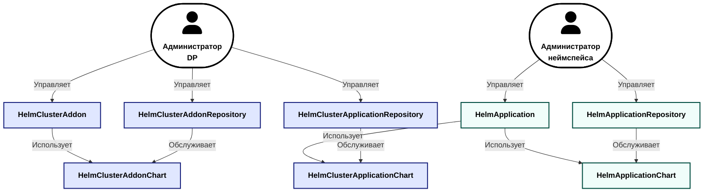

Модуль `operator-helm` позволяет декларативно управлять развёртыванием Helm-чартов в кластере Deckhouse Platform (DP).

В зависимости от области видимости создаваемых ресурсов Helm-чарты разделяются на аддоны и приложения:

- **Аддоны** ([HelmClusterAddon](cr.html#helmclusteraddon)) могут создавать кастомные и другие cluster-wide-ресурсы. Установкой аддонов и управлением ими занимается администратор DP.
- **Приложения** ([HelmApplication](cr.html#helmapplication)) создают только namespaced-ресурсы. Администратор неймспейса может устанавливать приложения и управлять ими в пределах своего неймспейса.

Чтобы включить модуль, воспользуйтесь одним из способов, описанных [в разделе «Настройки»](configuration.html).

## Основные возможности

Модуль предоставляет следующие возможности:

- декларативное управление развёртыванием Helm-чартов;
- установка чартов из HTTP(S)- и OCI-репозиториев через единый API;
- автоматическая синхронизация репозитория для просмотра и поиска доступных Helm-чартов и их версий;
- установка чартов администратором неймспейса без предоставления прав на cluster-wide-ресурсы;
- поддержка общих репозиториев приложений, доступных во всех неймспейсах;
- устранение отклонений от заданной конфигурации;
- режим обслуживания, который приостанавливает реконсиляцию для ручного вмешательства в релиз;
- поддержка приватных репозиториев с использованием корпоративного PKI;
- управление через [CLI-утилиту `d8`](/products/kubernetes-platform/documentation/v1/cli/d8/) или веб-интерфейс DP.

## Кастомные ресурсы

Кастомные ресурсы модуля разделяются по области видимости на cluster-wide-ресурсы, которыми управляет администратор DP, и namespaced-ресурсы, которыми управляет администратор соответствующего неймспейса.

```mermaid
flowchart TB
  classDef actor fill:#ffffff,stroke:#000000,color:#000000,stroke-width:3px;
  classDef cluster fill:#e0e7ff,stroke:#1a237e,color:#000000,stroke-width:2px;
  classDef ns fill:#f0fdfa,stroke:#004d40,color:#000000,stroke-width:2px;

  ADM(["<font size=12px>fa:fa-user</font><br/><b>Администратор<br/>DP</b>"]):::actor
  USR(["<font size=12px>fa:fa-user</font><br/><b>Администратор<br/>неймспейса</b>"]):::actor

  HCA["<b>HelmClusterAddon</b>"]:::cluster
  HCAR["<b>HelmClusterAddonRepository</b>"]:::cluster
  HCApR["<b>HelmClusterApplicationRepository</b>"]:::cluster

  HA["<b>HelmApplication</b>"]:::ns
  HAR["<b>HelmApplicationRepository</b>"]:::ns

  HCAC["<b>HelmClusterAddonChart</b>"]:::cluster
  HCApC["<b>HelmClusterApplicationChart</b>"]:::cluster
  HAC["<b>HelmApplicationChart</b>"]:::ns

  ADM -->|Управляет| HCA
  ADM -->|Управляет| HCAR
  ADM -->|Управляет| HCApR
  HCA -->|Использует| HCAC
  HCAR -->|Обслуживает| HCAC

  USR -->|Управляет| HA
  USR -->|Управляет| HAR
  HA -->|Использует| HAC
  HA -->|Использует| HCApC
  HAR -->|Обслуживает| HAC

  HCApR -->|Обслуживает| HCApC
```

Синей заливкой на схеме обозначены cluster-wide-ресурсы, бирюзовой — namespaced-ресурсы. Ресурсы HelmClusterAddonChart, HelmClusterApplicationChart и HelmApplicationChart модуль обслуживает сам. Они не предназначены для изменения вручную.

Администратор DP управляет следующими cluster-wide-ресурсами:

- [HelmClusterAddonRepository](/modules/operator-helm/cr.html#helmclusteraddonrepository) — описывает репозиторий Helm или OCI с чартами для установки на уровне кластера;
- [HelmClusterAddon](/modules/operator-helm/cr.html#helmclusteraddon) — описывает Helm-релиз, включая целевую версию чарта, неймспейс развёртывания и расширенные параметры установки (при необходимости);
- [HelmClusterApplicationRepository](/modules/operator-helm/cr.html#helmclusterapplicationrepository) — описывает репозиторий приложений, чарты которого доступны ресурсам [HelmApplication](/modules/operator-helm/cr.html#helmapplication) из любого неймспейса.

Администратор неймспейса управляет следующими ресурсами в своём неймспейсе:

- [HelmApplicationRepository](/modules/operator-helm/cr.html#helmapplicationrepository) — описывает репозиторий приложений, чарты которого доступны ресурсам [HelmApplication](/modules/operator-helm/cr.html#helmapplication) того же неймспейса;
- [HelmApplication](/modules/operator-helm/cr.html#helmapplication) — описывает Helm-релиз приложения, включая целевую версию чарта, репозиторий и параметры установки. В качестве источника чарта можно использовать [HelmApplicationRepository](/modules/operator-helm/cr.html#helmapplicationrepository) из того же неймспейса или [HelmClusterApplicationRepository](/modules/operator-helm/cr.html#helmclusterapplicationrepository).

Примеры настройки вышеописанных ресурсов приведены в [«Руководстве администратора»](admin_guide.html) и [«Руководстве пользователя»](user_guide.html).

## Ограничения

- Для одного ресурса [HelmClusterAddonChart](/modules/operator-helm/cr.html#helmclusteraddonchart) может существовать только один ссылающийся на него ресурс [HelmClusterAddon](/modules/operator-helm/cr.html#helmclusteraddon). Helm-чарты, используемые в аддоне, могут содержать определения кастомных ресурсов (Custom Resource Definition, CRD) и другие cluster-wide-ресурсы, повторная установка которых может привести к перебоям в работе сервисов.
- Для создания [HelmApplication](/modules/operator-helm/cr.html#helmapplication) требуются права уровня [роли `Admin`](/modules/user-authz/#текущая-ролевая-модель), поскольку приложение развёртывается с использованием ServiceAccount, обладающего аналогичными правами.
